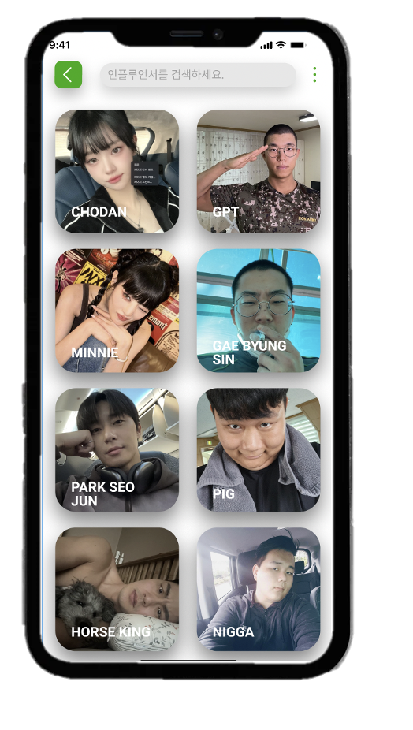

# 프로젝트 이름 (작성 필요)

프로젝트 소개 글 작성하기 (작성 필요)

## 화면 예시

## 기능 구현 목록

- [x] 회원가입 및 로그인 
- [x] 사용자가 원하는 포즈의 사진 추가 
- [x] 사진 포즈 분석 
- [x] 사용자가 업로드한 사진 검색
- [x] 분석된 포즈 카메라 화면에 표시
- [x] 사진 촬영 
- [x] 촬영된 사진 저장

## 커밋 컨벤션

### 메시지 작성 가이드

- 형식: <타입> 설명
- (예시 메시지 1) feat: 사진 업로드 기능 추가
- (예시 메시지 2) fix: 사진 검색 기능 버그 수정

### 타입 (Type)
- `feat`: 새로운 기능 추가
- `fix`: 버그 수정
- `docs`: 문서 변경
- `style`: 코드 스타일 변경(공백, 포맷팅 등)
- `refactor`: 코드 리팩토링
- `test`: 테스트 코드 추가/수정
- `chore`: 빌드 프로세스 수정 등의 보편적인 작업

### 설명 (Description)
변경 사항에 대한 설명 작성